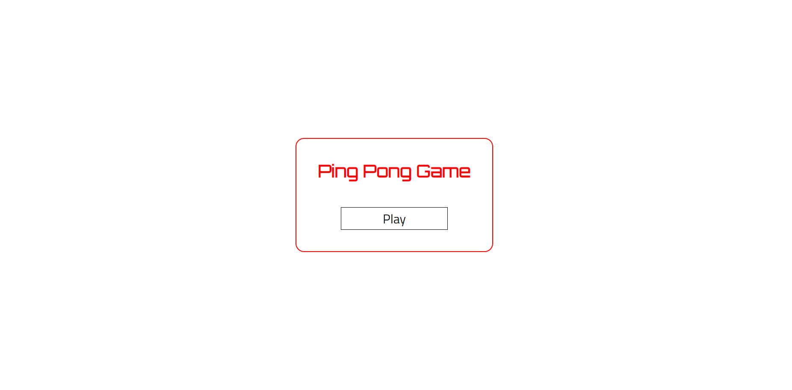
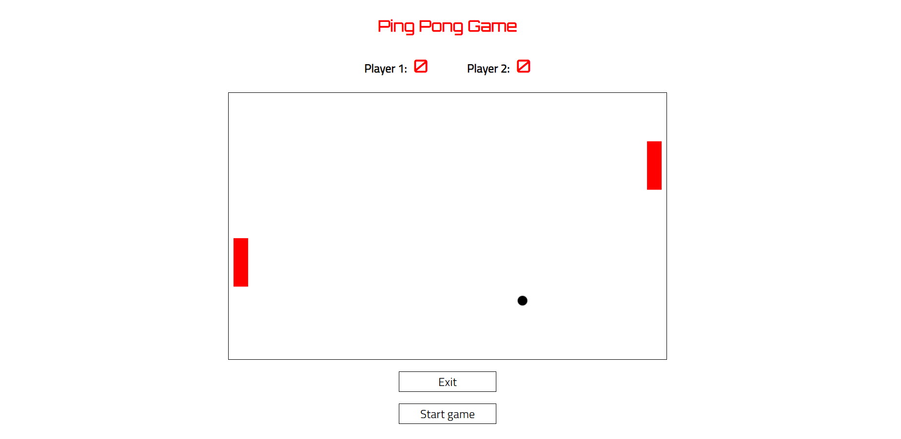

Зазработка приложения реального времени
========================
Задание
------------------------
Разработать и реализовать игру пинг-понг. Хранение и обработка модели происходмит на сервере. Общение сервера и клиента происходит по websocket. Для отрисовки вида используется canvas. Игра завершается по достижению нужного счёта одним из игроковю

Интерфейс системы представляет собой веб-приложение, позволяющее игрокам одной сети играть в пинг-понг. Движение блоками осуществляется с помощью клавиш **A**(вверх) и **z**(вниз). Игра останавливается при достижении одним из игроков счёта в 10 очков.

Возможности пользователей:
- играть в пинг-понг вдвоём в одной сети

## Пользовательский интерфейс (Figma)
1. Начальная страница
   
2. Страница игры
   

## Пользовательские сценарии работы
1. Первый пользователь попадает на страницу *index.php* и нажимает на кнопку **Play**, после чего попадает на страницу *game.php*. После этого второй пользователь делает то же самое. Затем один из них нажимает кнопку **Start game**, и игра начинается. Когда один из пользователей достигает счёта в 10 очков, игра останавоивается и появляется объявление "Game over".
2. Первый пользователь попадает на страницу *index.php* и нажимает на кнопку **Play**, после чего попадает на страницу *game.php*. Пока второй пользователь не зашёл, первый не сможет начать игру.
3. Если заходит третий поьзователь, он тоже не сможет присоединиться к игре, пока один из предыдущих не выйдет.

## Описание API сервера и хореографии
[Хореография](https://sequencediagram.org/index.html#initialData=C4S2BsFMAIBUAsQGdrOgQ2qCkBQuAFcdAT0gCcBGAWgD4kKA3CgLgGMB7AOy8jeCzxyHAK4BzeNADukAEZIObANaRghYmXIAmOg3LNy7br36Dh4yTPmKVa9aQo16TVkmDpywAOLoAtniIHKgAeaj0DFmEoFmgoADM1QM0tUPDWKMgY8hAJOzTyOiTHGJEABwATdGBIACF0cHBcfMKNCi0Siqra+sb7ZN0XQ18OZgJ0cvKoJsGWoMoY4eYAeVLS7kguYDGJqen9ClnNeegyyuqAJUgkEXA1Ztoi7Q6zyEvr2-x7x+O3DlKffx7AyHNoxX7-PyQIA)


## Описание алгоритмов
1. Алгоритм присоединения пользователя: когда пользователь заходит в игру, серверу отправляется сообщение с информацией о нём.
2. Алгоритм движения мяча: каждые 0,25 секунд сервер отпраляет актуальную информацию о положении мяча, благодаря которой клиентская часть отрисовывает игру.
3. Алгоритм движения блоками: при нажатии пользователем клавиш управления блоком на сервер отправляется позиция блока, сервер сохраняет информацию для последующего просчёта траектории движения мяча. 
4. Алгорим изменения счета: при забивании мяча сервер отпраляет информацию клиенту для увеличения счёта.
5. Алгоритм победы: при достижении одним  из игроков счета в 10 очков, сервер отправляет клиенту команду "завершить игру"

## Примеры HTTP запросов/ответов
*Запрос GET к index.php*
<br>URL запроса: http://localhost/lab4/index.php
<br>Метод запроса: GET
<br>Код статуса: 200 OK
<br>Удаленный адрес: [::1]:80
<br>Правило для URL перехода: strict-origin-when-cross-origin

<br>Accept: text/html,application/xhtml+xml,application/xml;q=0.9,image/avif,image/webp,image/apng,*/*;q=0.8,application/<br>signed-exchange;v=b3;q=0.9
<br>Accept-Encoding: gzip, deflate, br
<br>Accept-Language: ru,en;q=0.9
<br>Connection: keep-alive
<br>Cookie: PHPSESSID=6d791eafbbe3f09e25a2a83a403086e6
<br>Host: localhost
<br>Referer: http://localhost/lab4/game.php
<br>sec-ch-ua: "Chromium";v="106", "Yandex";v="22", "Not;A=Brand";v="99"
<br>sec-ch-ua-mobile: ?0
<br>sec-ch-ua-platform: "Windows"
<br>Sec-Fetch-Dest: document
<br>Sec-Fetch-Mode: navigate
<br>Sec-Fetch-Site: same-origin
<br>Sec-Fetch-User: ?1
<br>Upgrade-Insecure-Requests: 
<br>User-Agent: Mozilla/5.0 (Windows NT 10.0; Win64; x64) AppleWebKit/537.36 (KHTML, like Gecko) Chrome/106.0.0.0 YaBrowser/22.11.5.<br>715 Yowser/2.5 Safari/537.36

*Ответ GET от index.php*
<br>Connection: Keep-Alive
<br>Content-Encoding: gzip
<br>Content-Length: 458
<br>Content-Type: text/html; charset=UTF-8
<br>Date: Mon, 16 Jan 2023 23:54:00 GMT
<br>Keep-Alive: timeout=5, max=100
<br>Server: Apache/2.4.33 (Win64) OpenSSL/1.0.2u mod_fcgid/2.3.9 PHP/8.0.1
<br>Vary: Accept-Encoding
<br>X-Powered-By: PHP/8.0.1


## Значимые фрагменты кода
1. Алгоритм обработки сообщения от сервера
```js
ws.onmessage = function(e) {
        var temp_data = e.data 
        console.log(temp_data);
        var parse_data = JSON.parse(temp_data);
        event_type = parse_data.event;
        console.log(event_type);
        switch(event_type) {
            case "updateBall":
                ball_X = parse_data.ball_X;
                ball_Y = parse_data.ball_Y;
                drawActualState();
                break;
            case "updateResult":
                p1points.innerText = parse_data.p1points;
                p2points.innerText = parse_data.p2points;
                if(parse_data.p1points == 10 || parse_data.p2points == 10) {
                    alert("Game over!");
                    p1points.innerText = 0;
                    p2points.innerText = 0;
                }
                break;
            case "setRole":
                role = parse_data.role;
                console.log("Role: " + role);
                break;
            case "moveOpponent":
                if(parse_data.role == "left") {
                    paddleP1_Y = parse_data.y;
                } else if(parse_data.role == "right") {
                    paddleP2_Y = parse_data.y;
                }
                drawActualState();
            break;
        }
};
```
2. Алгоритм обработки сообщения сервером
```php
$ws_worker->onMessage = function ($connection, $data) use (&$paddleP1_Y, &$paddleP2_Y, &$left, &$right, &$changeState, &$gameTimer, &$updateBall) {
    $data = json_decode($data);
    switch($data->event) {
        case 'movePaddle':
            if ($connection == $left) {
                $paddleP1_Y = $data->y;
                $info = array('event' => 'moveOpponent', 'role' => 'left', 'y' => $paddleP1_Y );
                $right->send(json_encode_objs($info));
            } else if ($connection == $right) {
                $paddleP2_Y = $data->y;
                $info = array('event' => 'moveOpponent', 'role' => 'right', 'y' => $paddleP2_Y);
                $left->send(json_encode_objs($info));
            }
            break;

        case 'startGame':
            if ($left != NULL && $right != NULL) {
                $gameTimer =  Timer::add($changeState, function($updateBall, $left, $right, $connection)
                {
                    $data = $updateBall($connection);
                    $left->send($data);
                    $right->send($data);
                }, array($updateBall, $left, $right, $connection));
                }
            break;
        case 'stopGame':
            if ($left != NULL && $right != NULL) {
                Timer::del($gameTimer);
            }
            break;
    }

};
```